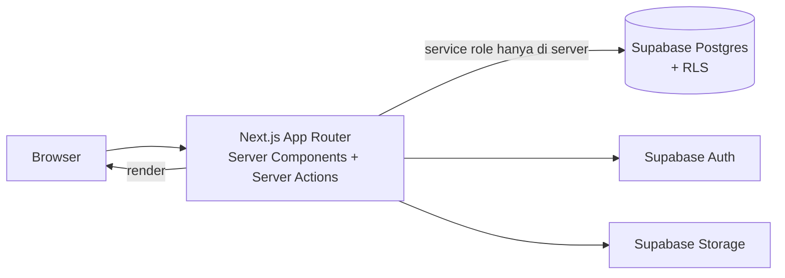
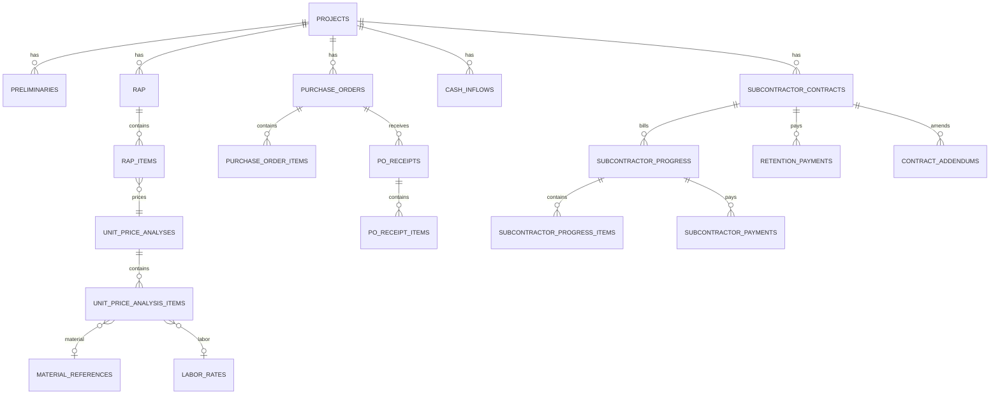
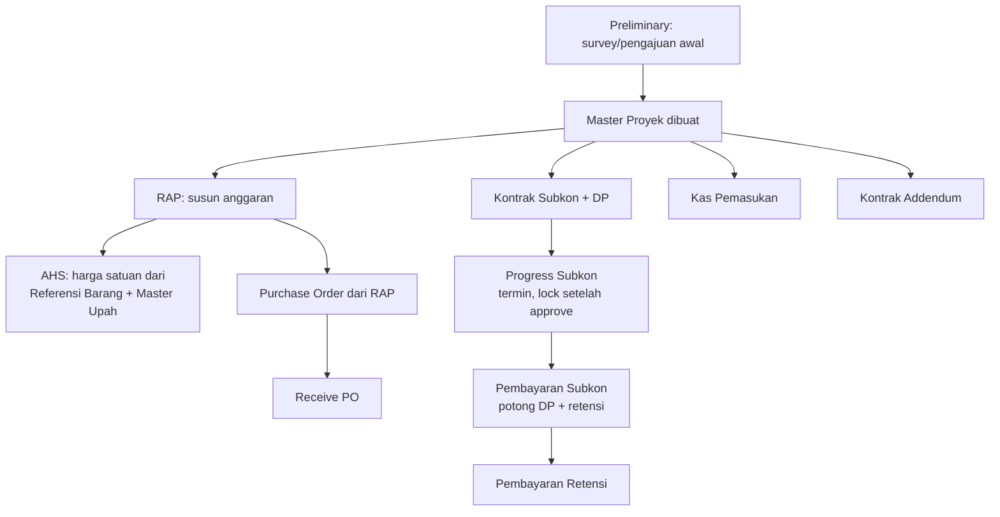

# PRD: Monitoring Proyek Konstruksi (Next.js + Supabase)

Sep 22, 2026 · @Someone

## 1. Ringkasan & Latar Belakang

Aplikasi **monitoring biaya proyek konstruksi & subkontraktor** untuk kontraktor umum — mengelola siklus dari perencanaan anggaran sampai pembayaran retensi subkon dalam satu sistem.

PRD ini disusun dari hasil bedah sistem referensi "Monitoring Project" (appadentis.cloud), lalu dirancang ulang sebagai produk baru dengan stack Next.js + Supabase + shadcn/ui, di-deploy ke Vercel.

**Masalah yang diselesaikan:**

- Perhitungan harga satuan (AHS), potongan DP, dan retensi rawan salah kalau masih manual di spreadsheet terpisah per proyek.
- Tidak ada satu sumber data untuk status kontrak, progress subkon, dan sisa tagihan — sering harus cek beberapa file berbeda.
- Data finansial proyek perlu dibatasi per role (Admin, staf gudang, dst) tanpa hardcode di kode aplikasi.

## 2. Tujuan Produk & Metrik Keberhasilan

**Tujuan:**

- Satu sumber data untuk seluruh siklus proyek: anggaran, kontrak subkon, procurement, progress, sampai pembayaran.
- Otomatisasi perhitungan harga satuan (AHS) dan pembayaran subkon (potongan DP + retensi + sisa tagihan) supaya tidak dihitung manual.
- Akses data dibatasi per role secara konsisten (role + menu diatur dari database, bukan hardcode).
- Riwayat perubahan (audit trail) tersedia untuk data finansial — siapa mengubah apa, kapan.

**Metrik keberhasilan (MVP):**

- Waktu buat 1 RAP baru dari kosong sampai lengkap turun dibanding proses manual saat ini.
- 100% perhitungan pembayaran subkon (nilai dibayar, sisa tagihan) dihasilkan sistem, bukan hitung manual.
- 0 insiden user mengakses modul di luar hak role-nya.

**Non-goals (di luar MVP):**

- Modul akuntansi/general ledger penuh (jurnal, neraca).
- Integrasi payment gateway / rekonsiliasi bank otomatis.
- Aplikasi mobile native (cukup web responsive dulu).
- Notifikasi otomatis WhatsApp/email (masuk fase 2).

## 3. Target Pengguna & Role

| Role | Tanggung Jawab | Akses Utama |
| --- | --- | --- |
| Super Admin | Kelola seluruh sistem, termasuk role & menu | Semua modul + Settings |
| Admin | Kelola proyek, RAP, kontrak, pembayaran sehari-hari | Semua modul operasional, tanpa Settings |
| User (staf proyek) | Input progress, preliminary, lihat data proyek yang ditugaskan | Modul proyek sesuai penugasan, read-only di beberapa data finansial |
| User Gudang | Kelola Purchase Order & penerimaan barang | Purchase Order, Receive PO, Referensi Barang |

Hak akses granular (view/add/edit/delete per menu per role) diatur lewat tabel `role_menu_access` — lihat bagian Skema Data.

## 4. Ruang Lingkup

**In-scope (MVP):**

- Master Data: Proyek, Referensi Barang, Master Upah
- RAP (Rencana Anggaran Proyek) + AHS (Analisa Harga Satuan)
- Kontrak Subkon + Kontrak Addendum (dengan upload bukti DP)
- Purchase Order (dibuat dari RAP) + Receive PO
- Progress Subkon (dengan mekanisme lock setelah approve)
- Pembayaran Subkon (potong DP + retensi, hitung sisa tagihan) + Pembayaran Retensi
- Kas Pemasukan
- RBAC dinamis: Master User, Master Role (+ Role Access matrix), Master Menu

**Out-of-scope (fase berikutnya):**

- Modul akuntansi/general ledger, laporan pajak
- Integrasi payment gateway / bank
- Notifikasi otomatis (WhatsApp/email)
- Laporan BI lanjutan (dashboard analitik, export PDF kompleks)
- Aplikasi mobile native
- Multi-tenant (multi perusahaan dalam satu instance)

## 5. Tech Stack & Arsitektur

| Layer | Pilihan | Catatan |
| --- | --- | --- |
| Frontend framework | Next.js (App Router) | React Server Components untuk read, Server Actions untuk mutasi |
| UI | shadcn/ui + Tailwind CSS | Table, Dialog, Form, Sidebar dari shadcn; ikon Lucide |
| Data grid | TanStack Table | Untuk tabel dengan search, sort, pagination di tiap modul |
| Form & validasi | React Hook Form + Zod | Skema Zod dipakai ulang di client & Server Action |
| Auth | Supabase Auth (email/password) | Session di-sync ke Next.js lewat `@supabase/ssr` |
| Database | Supabase Postgres | Row Level Security (RLS) aktif di semua tabel |
| File storage | Supabase Storage | Bukti DP, dokumen PO, lampiran progress |
| Hosting | Vercel | Deploy dari repo Git, environment variable untuk Supabase URL/key |

**Arsitektur data:**

**Pola akses data:** komponen server membaca langsung dari Supabase (RSC), mutasi lewat Server Action yang memanggil Supabase client dengan konteks user (RLS menegakkan hak akses di level baris). Role & menu disimpan di tabel `role_menu_access`, dibaca sekali per login untuk membangun sidebar dan proteksi route di middleware Next.js.

## 6. Modul & Fitur Detail

| Modul | Deskripsi | Field Utama | Acceptance Criteria |
| --- | --- | --- | --- |
| Master Proyek | Data induk proyek | Nama pekerjaan, no. kontrak, nilai kontrak, lokasi, tanggal mulai–selesai | User dengan izin `add` bisa buat proyek baru; list bisa dicari & dipaginasi |
| Referensi Barang | Katalog material | Nama barang, spesifikasi, harga, unit | Harga dipakai otomatis saat dipilih di AHS/PO |
| Master Upah | Katalog tenaga kerja | Nama pekerjaan, spesifikasi, harga, unit | Sama seperti Referensi Barang, untuk komponen upah |
| Preliminary | Pengajuan/survey awal sebelum proyek jalan | Proyek terkait, no. kontrak, yang mengajukan, tanggal, tujuan, total | Terhubung ke 1 proyek; total bisa direkap per proyek |
| RAP | Rencana anggaran proyek, berisi baris item | Proyek terkait, no. RAP, tanggal, status, total anggaran (dihitung dari item) | Grand Total Anggaran otomatis terupdate saat item berubah |
| AHS (Analisa Harga Satuan) | Hitung harga satuan pekerjaan dari komponen material + upah + margin | Kode AHS, nama, satuan, profit %, harga hasil hitung | Harga akhir = (total komponen material+upah) × (1 + profit%), read-only, dihitung sistem |
| Kontrak Subkon | Kontrak dengan subkontraktor | Proyek terkait, nama subkon, no. kontrak, nilai kontrak, DP, file bukti DP | Upload bukti DP wajib sebelum status kontrak aktif |
| Kontrak Addendum | Perubahan nilai/scope kontrak | Kontrak asal, no. addendum, nilai kontrak baru, tanggal mulai–selesai | Riwayat addendum tetap tersimpan, tidak menimpa data kontrak awal |
| Purchase Order | Pembelian material, bisa dibuat dari RAP | Proyek, RAP asal (opsional), no. PO, tujuan (supplier), tanggal kirim, jenis payment, jatuh tempo, status, item barang+qty+harga | Total PO dihitung dari item; status berubah otomatis mengikuti Receive PO |
| Receive PO | Konfirmasi barang PO diterima | PO terkait, tanggal terima, status pengiriman, qty diterima per item | Qty diterima tidak boleh melebihi qty PO |
| Progress Subkon | Tagihan progress per termin dari subkon | Kontrak subkon, no. penagihan/termin, tanggal, status (draft/locked), total progress, item pekerjaan+volume+% | Setelah status `locked`, item tidak bisa diedit lagi (hanya role tertentu yang bisa unlock) |
| Pembayaran Subkon | Pembayaran ke subkon berdasar progress | Kontrak subkon, progress terkait, no. termin, tanggal, nilai progress, potongan DP, nilai retensi, nilai dibayar, sisa tagihan | `nilai_dibayar = nilai_progress − potongan_dp − nilai_retensi`, dihitung sistem, bukan input manual |
| Pembayaran Retensi | Pelunasan retensi yang ditahan | Kontrak subkon, keterangan, tanggal, nilai retensi, nilai dibayar | Total retensi dibayar tidak boleh melebihi total retensi yang ditahan |
| Kas Pemasukan | Dana masuk dari klien/owner per proyek | Proyek, no. kontrak, tanggal kas masuk, nilai, keterangan | Bisa direkap per proyek sebagai sisi pendapatan |
| Master User / Role / Menu (Settings) | Kelola user, role, dan menu dinamis | User: nama, email, role. Role: nama, keterangan, matrix akses per menu. Menu: nama, header, sub-menu, urutan | Sidebar & proteksi route mengikuti `role_menu_access`, bukan hardcode |

## 7. Skema Data (Postgres / Supabase)

Semua tabel memakai `id uuid default gen_random_uuid()`, `created_at`, `updated_at`; RLS aktif di semua tabel (default deny, policy eksplisit per role).

| Tabel | Kolom Utama | Relasi | Catatan RLS |
| --- | --- | --- | --- |
| `profiles` | user\_id (FK auth.users), full\_name, email, role\_id | 1-1 ke `auth.users`, FK ke `roles` | User hanya baca profil sendiri; Super Admin baca semua |
| `roles` | name, description | — | Hanya Super Admin CRUD |
| `menus` | name, header, parent\_id, sort\_order, path, icon | Self-FK (`parent_id`) | Dibaca semua user login, CRUD hanya Super Admin |
| `role_menu_access` | role\_id, menu\_id, can\_view, can\_add, can\_edit, can\_delete | FK `roles`, `menus` | Dibaca semua user login, CRUD hanya Super Admin |
| `projects` | nama\_pekerjaan, no\_kontrak, nilai\_kontrak, lokasi, tanggal\_mulai, tanggal\_selesai, created\_by | FK `profiles` | Read: semua role internal; write: Admin/Super Admin |
| `preliminaries` | project\_id, no\_kontrak, yang\_mengajukan, tanggal, tujuan, total | FK `projects` | Sama seperti `projects` |
| `rap` | project\_id, no\_rap, tanggal, status, total\_anggaran | FK `projects` | Sama seperti `projects` |
| `rap_items` | rap\_id, ahs\_id, uraian\_pekerjaan, volume, satuan, harga\_satuan, subtotal | FK `rap`, `unit_price_analyses` | Ikut policy `rap` induk |
| `material_references` | nama\_barang, spesifikasi, harga, unit | — | Read semua role internal; write Admin ke atas |
| `labor_rates` | nama\_pekerjaan, spesifikasi, harga, unit | — | Sama seperti `material_references` |
| `unit_price_analyses` | kode\_ahs, nama\_ahs, satuan, profit\_percent, harga | — | Read semua; write Admin ke atas |
| `unit_price_analysis_items` | ahs\_id, tipe (barang/upah), referensi\_id, koefisien, harga, subtotal | FK `unit_price_analyses` | Ikut policy induk |
| `subcontractor_contracts` | project\_id, nama\_subkon, no\_kontrak, nilai\_kontrak, dp, tanggal, bukti\_dp\_path | FK `projects` | Read Admin ke atas; write Admin/Super Admin |
| `contract_addendums` | contract\_id, no\_kontrak\_addendum, nilai\_kontrak, tanggal\_mulai, tanggal\_selesai | FK `subcontractor_contracts` | Ikut policy induk |
| `purchase_orders` | project\_id, rap\_id, no\_po, tanggal, tujuan\_po, tanggal\_pengiriman, jenis\_payment, tgl\_jatuh\_tempo, status\_po | FK `projects`, `rap` | Read/write User Gudang + Admin ke atas |
| `purchase_order_items` | po\_id, barang\_id, qty, harga, subtotal | FK `purchase_orders`, `material_references` | Ikut policy induk |
| `po_receipts` | po\_id, tanggal\_terima, status\_pengiriman | FK `purchase_orders` | Sama seperti `purchase_orders` |
| `po_receipt_items` | receipt\_id, po\_item\_id, qty\_diterima | FK `po_receipts` | Ikut policy induk |
| `subcontractor_progress` | contract\_id, no\_penagihan, tanggal\_penagihan, status, total\_progress, locked\_at | FK `subcontractor_contracts` | Read Admin ke atas; `locked_at` diisi lewat Server Action khusus |
| `subcontractor_progress_items` | progress\_id, uraian\_pekerjaan, volume, persentase\_progress, subtotal | FK `subcontractor_progress` | Tidak bisa diubah jika induk `locked` |
| `subcontractor_payments` | contract\_id, progress\_id, no\_termin, tanggal\_pembayaran, nilai\_progress, potongan\_dp, nilai\_retensi, nilai\_dibayar, sisa\_tagihan | FK `subcontractor_contracts`, `subcontractor_progress` | Write hanya Admin/Super Admin |
| `retention_payments` | contract\_id, keterangan, tanggal\_pembayaran, nilai\_retensi, nilai\_dibayar | FK `subcontractor_contracts` | Write hanya Admin/Super Admin |
| `cash_inflows` | project\_id, no\_kontrak, tanggal\_kas\_masuk, nilai, keterangan | FK `projects` | Write hanya Admin/Super Admin |

**Catatan RLS:** dipakai fungsi helper `get_my_role()` (SQL function, `security definer`) yang membaca `role_id` dari `profiles` berdasar `auth.uid()`, dipakai di semua policy supaya konsisten.

## 8. Alur Pengguna Utama

**Langkah kunci:**

1. Proyek dibuat di Master Proyek, opsional didahului Preliminary.
2. RAP disusun; tiap baris item mengambil harga dari AHS (bukan input manual).
3. Kontrak Subkon ditandatangani dengan DP; PO material dibuat dari RAP lalu diterima lewat Receive PO.
4. Subkon mengajukan Progress per termin → di-approve → status `locked` → tidak bisa diedit lagi.
5. Pembayaran Subkon dihitung otomatis dari progress dikurangi DP dan retensi, sisa tagihan berjalan otomatis.
6. Retensi dibayar terpisah setelah masa pemeliharaan selesai.
7. Kas Pemasukan dan Kontrak Addendum dicatat paralel, terhubung ke proyek yang sama.

## 9. Kebutuhan Non-Fungsional

**Autentikasi & Otorisasi**

- Login via Supabase Auth (email/password); session di-refresh lewat Next.js middleware.
- Setiap request ke Postgres lewat client yang terikat sesi user — RLS yang menegakkan batas akses, bukan hanya UI.
- Service role key Supabase hanya dipakai di server (server actions/route handlers), tidak pernah dikirim ke client.

**Audit Trail**

- Semua tabel transaksi punya `created_by`, `created_at`, `updated_at`; perubahan pada data finansial (Progress, Pembayaran Subkon, Retensi) dicatat di tabel `activity_logs` terpisah.

**Keamanan File**

- Bukti DP dan dokumen lain disimpan di Supabase Storage dengan bucket privat; akses lewat signed URL, bukan URL publik permanen.

**Performa**

- Index di setiap foreign key dan kolom yang sering difilter (`project_id`, `tanggal`, `status`).
- List panjang (PO, Progress, dsb) pakai pagination sisi server, bukan fetch semua data ke client.

**Environment & Deployment**

- Konfigurasi Supabase URL/anon key/service role key disimpan sebagai Environment Variable di Vercel, dipisah per environment (preview/production).
- Migrasi database dikelola lewat Supabase CLI (`supabase migration`), bukan diubah manual dari dashboard di production.

**Aksesibilitas & Responsif**

- UI berbasis shadcn/ui sudah accessible by default (keyboard nav, ARIA); layout tetap dipakai di layar tablet untuk kebutuhan lapangan.

## 10. Rencana Rilis / Milestone

| Fase | Fokus | Fitur | Keluaran |
| --- | --- | --- | --- |
| Fase 0 — Fondasi | Setup project & auth | Setup Next.js + Supabase + shadcn, skema DB awal, login, RBAC dasar (roles, menus, role\_menu\_access) | Kerangka aplikasi bisa login, sidebar dinamis per role |
| Fase 1 — Master Data & Anggaran | Data induk + perencanaan biaya | Master Proyek, Referensi Barang, Master Upah, AHS, RAP | Bisa susun RAP lengkap dengan harga satuan otomatis |
| Fase 2 — Kontrak & Procurement | Sisi kontrak subkon dan pembelian | Kontrak Subkon, Kontrak Addendum, Purchase Order, Receive PO | Alur dari kontrak sampai barang diterima jalan penuh |
| Fase 3 — Billing & Pembayaran | Sisi tagihan dan pembayaran | Progress Subkon (+lock), Pembayaran Subkon, Pembayaran Retensi, Kas Pemasukan | MVP lengkap — seluruh siklus proyek tercakup |
| Fase 4 — Pengerasan | Siap produksi | Audit log, RLS review menyeluruh, pagination/performance pass, UAT dengan data proyek nyata | Siap dipakai harian, bukan lagi prototipe |

Fase 0–3 adalah kandidat MVP; Fase 4 wajib sebelum dipakai untuk data finansial produksi.

## 11. Risiko, Asumsi & Pertanyaan Terbuka

**Asumsi:**

- Nama produk & branding belum ditentukan — dokumen ini pakai nama generik.
- Skema data disusun dari observasi UI sistem referensi (bukan dari source code aslinya), jadi field detail (terutama item Preliminary, RAP, PO) adalah rekonstruksi terbaik, perlu divalidasi ulang saat implementasi.
- Satu perusahaan kontraktor per instance (belum multi-tenant).

**Risiko:**

- RLS Supabase untuk hak akses granular per-menu (view/add/edit/delete) lebih rumit dibanding RBAC statis — perlu desain policy yang hati-hati supaya tidak bocor atau terlalu ketat.
- Logic perhitungan berlapis (AHS → RAP → Pembayaran Subkon) rawan salah kalau tidak dipisah jadi fungsi/util yang diuji unit test.
- Mekanisme "lock" pada Progress Subkon perlu aturan jelas siapa yang boleh unlock, supaya tidak jadi celah audit.

**Pertanyaan terbuka (perlu dijawab sebelum/​saat Fase 0–1):**

- [ ] Apa nama produk final?
- [ ] Format mata uang & pembulatan angka (Rupiah, 0 desimal)?
- [ ] Berapa role yang benar-benar dibutuhkan di MVP — 4 seperti di bagian 3, atau perlu ditambah/dikurangi?
- [ ] Apakah retensi selalu persentase tetap, atau bisa beda tiap kontrak?
- [ ] Siapa yang berwenang unlock Progress Subkon yang sudah locked?
